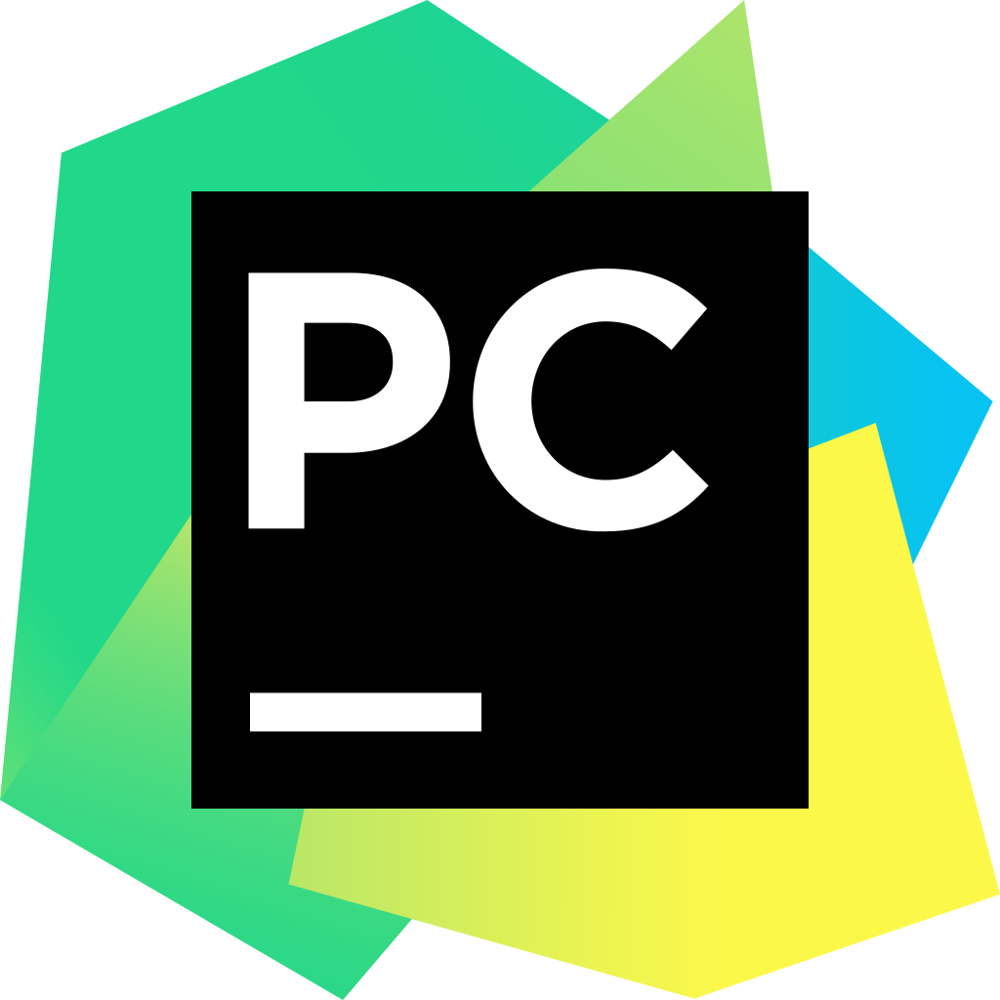
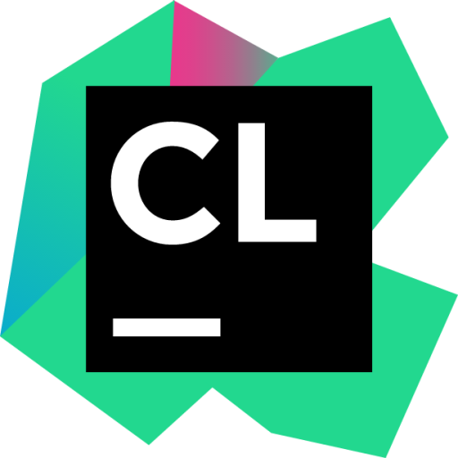
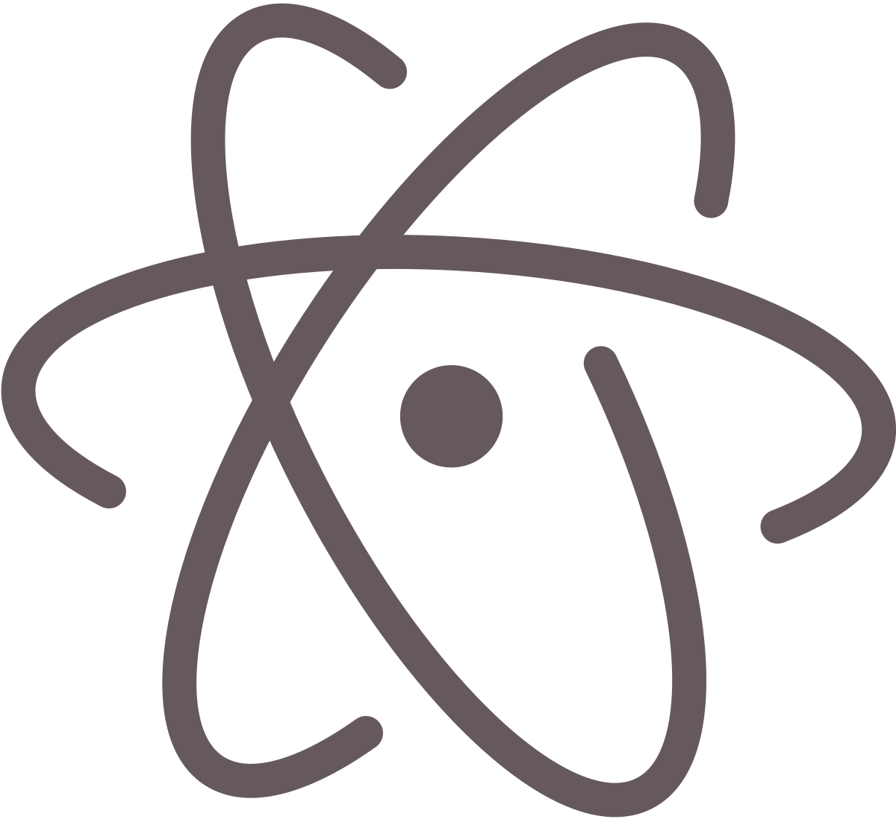
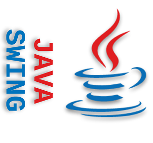
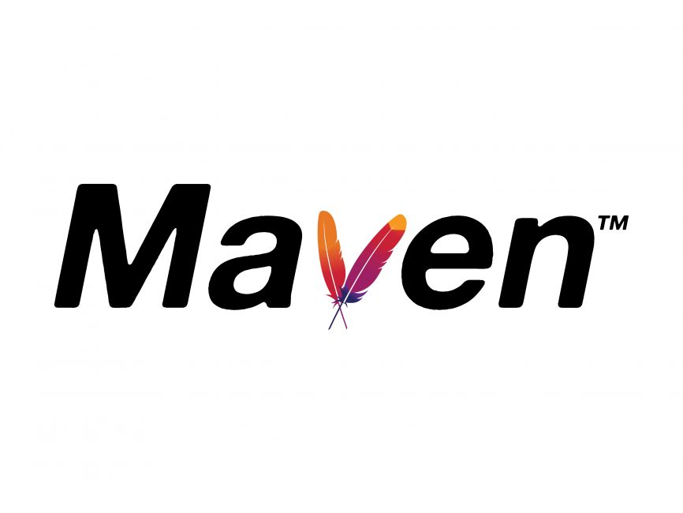

``````
                                                     
                        _ _   _    _        _  _             __          __           _      _   _   _ _ 
                       ( | ) | |  | |      | || |            \ \        / /          | |    | | | | ( | )
                        V V  | |__| |  ___ | || |  ___        \ \  /\  / /___   _ __ | |  __| | | |  V V 
                             |  __  | / _ \| || | / _ \        \ \/  \/ // _ \ | '__|| | / _` | | |      
                             | |  | ||  __/| || || (_) |  _     \  /\  /| (_) || |   | || (_| | |_|      
                             |_|  |_| \___||_||_| \___/  ( )     \/  \/  \___/ |_|   |_| \__,_| (_)      
                                                         |/                                              
                                                                             
                       
``````     
<h1 align="center" title="Happy to see you here :)"> 𝐖𝐞𝐥𝐜𝐨𝐦𝐞 𝐭𝐨 𝐌𝐲 𝐏𝐫𝐨𝐟𝐢𝐥𝐞... </h1>
<p align="center">  </p>
<h3 align="center">𝐈’𝐦 𝐒𝐚𝐛𝐚 𝐌𝐚𝐝𝐚𝐝𝐢. 𝐘𝐨𝐮 𝐜𝐚𝐧 𝐟𝐢𝐧𝐝 𝐦𝐞 𝐨𝐧 <a href="https://www.linkedin.com/in/sabamadadi" target="_blank">𝐋𝐢𝐧𝐤𝐞𝐝𝐈𝐧</a> 𝐟𝐨𝐫 𝐦𝐨𝐫𝐞 𝐢𝐧𝐟𝐨𝐫𝐦𝐚𝐭𝐢𝐨𝐧 𝐚𝐛𝐨𝐮𝐭 𝐦𝐞! </h3>


<h4 align="left" title=""> 𝐃𝐢𝐫𝐞𝐜𝐭 𝐚𝐧𝐝 𝐐𝐮𝐢𝐜𝐤 𝐂𝐨𝐧𝐭𝐚𝐜𝐭: </h4> <a href="https://t.me/sabamadadi24"> </a>

<h4 align="left" title=""> 𝐎𝐭𝐡𝐞𝐫 𝐏𝐫𝐨𝐟𝐢𝐥𝐞𝐬: </h4>
  
<a href="https://gitlab.com/sabamadadi1"> </a> <a href="https://leetcode.com/sabamadadi/"> </a> <a href="https://codeforces.com/profile/sabamadadi"> </a> <a href="https://stackoverflow.com/users/21433236/saba-madadi"> </a> <a href="https://www.hackerrank.com/sabamadadi9?hr_r=1"> </a>


<h2 align="center" > 📃 𝐑𝐞𝐩𝐨𝐬𝐢𝐭𝐨𝐫𝐢𝐞𝐬 </h2>

<h3 align="left" title=""> 𝐁.𝐒𝐜. 𝐂𝐨𝐮𝐫𝐬𝐞𝐬: </h3>

* 𝐅𝐢𝐫𝐬𝐭 𝐒𝐞𝐦𝐞𝐬𝐭𝐞𝐫
  * 𝐅𝐮𝐧𝐝𝐚𝐦𝐞𝐧𝐭𝐚𝐥𝐬 𝐨𝐟 𝐂𝐨𝐦𝐩𝐮𝐭𝐞𝐫 𝐚𝐧𝐝 𝐏𝐫𝐨𝐠𝐫𝐚𝐦𝐦𝐢𝐧𝐠
    * Item 3
  * 𝐌𝐚𝐭𝐡𝐞𝐦𝐚𝐭𝐢𝐜𝐚𝐥 𝐒𝐨𝐟𝐭𝐰𝐚𝐫𝐞 𝐈
  * 𝐏𝐡𝐲𝐬𝐢𝐜𝐬 𝐈 + 𝐋𝐚𝐛
  * 𝐂𝐚𝐥𝐜𝐮𝐥𝐮𝐬 𝐈
    * Item 3
  
* 𝐒𝐞𝐜𝐨𝐧𝐝 𝐒𝐞𝐦𝐞𝐬𝐭𝐞𝐫
  * 𝐀𝐝𝐯𝐚𝐧𝐜𝐞𝐝 𝐂𝐨𝐦𝐩𝐮𝐭𝐞𝐫 𝐏𝐫𝐨𝐠𝐫𝐚𝐦𝐦𝐢𝐧𝐠
    
    * <a href="https://github.com/sabamadadi/MelodyHub">  </a>
  * 𝐈𝐦𝐚𝐠𝐞 𝐏𝐫𝐨𝐜𝐞𝐬𝐬𝐢𝐧𝐠
  * 𝐌𝐚𝐭𝐡𝐞𝐦𝐚𝐭𝐢𝐜𝐚𝐥 𝐒𝐨𝐟𝐭𝐰𝐚𝐫𝐞 𝐈𝐈
  * 𝐅𝐨𝐮𝐧𝐝𝐚𝐭𝐢𝐨𝐧 𝐨𝐟 𝐌𝐚𝐭𝐡 𝐒𝐜𝐢𝐞𝐧𝐜𝐞𝐬
  * 𝐂𝐚𝐥𝐜𝐮𝐥𝐮𝐬 𝐈𝐈
  * 𝐅𝐮𝐧𝐝𝐚𝐦𝐞𝐧𝐭𝐚𝐥𝐬 𝐨𝐟 𝐂𝐨𝐦𝐛𝐢𝐧𝐚𝐭𝐨𝐫𝐢𝐜𝐬

* 𝐓𝐡𝐢𝐫𝐝 𝐒𝐞𝐦𝐞𝐬𝐭𝐞𝐫
  * 𝐃𝐚𝐭𝐚 𝐒𝐭𝐫𝐮𝐜𝐭𝐮𝐫𝐞𝐬 𝐚𝐧𝐝 𝐀𝐥𝐠𝐨𝐫𝐢𝐭𝐡𝐦𝐬 + 𝐋𝐚𝐛
  * 𝐅𝐨𝐮𝐧𝐝𝐚𝐭𝐢𝐨𝐧 𝐨𝐟 𝐌𝐚𝐭𝐫𝐢𝐜𝐞𝐬 𝐚𝐧𝐝 𝐋𝐢𝐧𝐞𝐚𝐫 𝐀𝐥𝐠𝐞𝐛𝐫𝐚
  * 𝐅𝐨𝐮𝐧𝐝𝐚𝐭𝐢𝐨𝐧 𝐨𝐟 𝐋𝐨𝐠𝐢𝐜 𝐚𝐧𝐝 𝐒𝐞𝐭 𝐓𝐡𝐞𝐨𝐫𝐲

* 𝐅𝐨𝐮𝐫𝐭𝐡 𝐒𝐞𝐦𝐞𝐬𝐭𝐞𝐫
  * 𝐍𝐞𝐮𝐫𝐚𝐥 𝐍𝐞𝐭𝐰𝐨𝐫𝐤
  * 𝐅𝐨𝐮𝐧𝐝𝐚𝐭𝐢𝐨𝐧 𝐨𝐟 𝐌𝐚𝐜𝐡𝐢𝐧𝐞 𝐋𝐞𝐚𝐫𝐧𝐢𝐧𝐠
  * 𝐏𝐫𝐢𝐧𝐜𝐢𝐩𝐥𝐞𝐬 𝐨𝐟 𝐂𝐨𝐦𝐩𝐮𝐭𝐞𝐫 𝐒𝐲𝐬𝐭𝐞𝐦𝐬 & 𝐋𝐨𝐠𝐢𝐜𝐚𝐥 𝐂𝐢𝐫𝐜𝐮𝐢𝐭𝐬 𝐚𝐧𝐝 𝐂𝐨𝐦𝐩𝐮𝐭𝐞𝐫 𝐀𝐫𝐜𝐡𝐢𝐭𝐞𝐜𝐭𝐮𝐫𝐞 𝐋𝐚𝐛
  * 𝐅𝐮𝐧𝐝𝐚𝐦𝐞𝐧𝐭𝐚𝐥𝐬 𝐨𝐟 𝐂𝐨𝐦𝐩𝐮𝐭𝐢𝐧𝐠 𝐓𝐡𝐞𝐨𝐫𝐲
  * 𝐏𝐫𝐨𝐛𝐚𝐛𝐢𝐥𝐢𝐭𝐲 𝐈

 
* 𝐅𝐢𝐟𝐭𝐡 𝐒𝐞𝐦𝐞𝐬𝐭𝐞𝐫
  * 𝐏𝐫𝐢𝐧𝐜𝐢𝐩𝐥𝐞𝐬 𝐨𝐟 𝐎𝐩𝐞𝐫𝐚𝐭𝐢𝐧𝐠 𝐒𝐲𝐬𝐭𝐞𝐦𝐬 + 𝐋𝐚𝐛
  * 𝐓𝐡𝐞𝐨𝐫𝐲 𝐨𝐟 𝐂𝐨𝐦𝐩𝐮𝐭𝐚𝐭𝐢𝐨𝐧
  * 𝐅𝐨𝐮𝐧𝐝𝐚𝐭𝐢𝐨𝐧 𝐨𝐟 𝐌𝐚𝐭𝐡𝐞𝐦𝐚𝐭𝐢𝐜𝐚𝐥 𝐀𝐧𝐚𝐥𝐲𝐬𝐢𝐬
  * 𝐀𝐧𝐚𝐥𝐲𝐬𝐢𝐬 𝐚𝐧𝐝 𝐃𝐞𝐬𝐢𝐠𝐧 𝐨𝐟 𝐒𝐲𝐬𝐭𝐞𝐦

    * <a href="https://github.com/sabamadadi/MelodyHub">  </a>
  * 𝐌𝐚𝐭𝐡𝐞𝐦𝐚𝐭𝐢𝐜𝐚𝐥 𝐒𝐨𝐟𝐭𝐰𝐚𝐫𝐞 2
  * 𝐏𝐡𝐲𝐬𝐢𝐜𝐬 𝟏
    * Item 3

<h3 align="left" title=""> 𝐑𝐞𝐬𝐞𝐚𝐫𝐜𝐡 𝐀𝐬𝐬𝐢𝐬𝐭𝐚𝐧𝐭 (𝐑𝐀): </h3>

<h3 align="left" title=""> 𝐇𝐞𝐚𝐝 𝐓𝐞𝐚𝐜𝐡𝐢𝐧𝐠 𝐀𝐬𝐬𝐢𝐬𝐭𝐚𝐧𝐭 (𝐇𝐞𝐚𝐝 𝐓𝐀): </h3>

* 𝐒𝐩𝐫𝐢𝐧𝐠 𝟐𝟎𝟐𝟓
  * 𝐌𝐚𝐜𝐡𝐢𝐧𝐞 𝐋𝐞𝐚𝐫𝐧𝐢𝐧𝐠

* 𝐅𝐚𝐥𝐥 𝟐𝟎𝟐𝟒
  * 𝐀𝐫𝐭𝐢𝐟𝐢𝐜𝐢𝐚𝐥 𝐍𝐞𝐮𝐫𝐚𝐥 𝐍𝐞𝐭𝐰𝐨𝐫𝐤𝐬
  * 𝐌𝐚𝐜𝐡𝐢𝐧𝐞 𝐋𝐞𝐚𝐫𝐧𝐢𝐧𝐠
  * 𝐅𝐮𝐧𝐝𝐚𝐦𝐞𝐧𝐭𝐚𝐥𝐬 𝐨𝐟 𝐂𝐨𝐦𝐩𝐮𝐭𝐞𝐫 𝐚𝐧𝐝 𝐏𝐫𝐨𝐠𝐫𝐚𝐦𝐦𝐢𝐧𝐠

* 𝐒𝐩𝐫𝐢𝐧𝐠 𝟐𝟎𝟐𝟒
  * 𝐀𝐝𝐯𝐚𝐧𝐜𝐞𝐝 𝐂𝐨𝐦𝐩𝐮𝐭𝐞𝐫 𝐏𝐫𝐨𝐠𝐫𝐚𝐦𝐦𝐢𝐧𝐠

<h3 align="left" title=""> 𝐓𝐞𝐚𝐜𝐡𝐢𝐧𝐠 𝐀𝐬𝐬𝐢𝐬𝐭𝐚𝐧𝐭 (𝐓𝐀): </h3>

* 𝐒𝐩𝐫𝐢𝐧𝐠 𝟐𝟎𝟐𝟓
  * 𝐏𝐫𝐢𝐧𝐜𝐢𝐩𝐥𝐞𝐬 𝐨𝐟 𝐂𝐨𝐦𝐩𝐮𝐭𝐞𝐫 𝐒𝐲𝐬𝐭𝐞𝐦𝐬 & 𝐋𝐨𝐠𝐢𝐜𝐚𝐥 𝐂𝐢𝐫𝐜𝐮𝐢𝐭𝐬 𝐚𝐧𝐝 𝐂𝐨𝐦𝐩𝐮𝐭𝐞𝐫 𝐀𝐫𝐜𝐡𝐢𝐭𝐞𝐜𝐭𝐮𝐫𝐞 𝐋𝐚𝐛
  * 𝐃𝐚𝐭𝐚 𝐒𝐭𝐫𝐮𝐜𝐭𝐮𝐫𝐞𝐬 𝐚𝐧𝐝 𝐀𝐥𝐠𝐨𝐫𝐢𝐭𝐡𝐦𝐬 + 𝐋𝐚𝐛
  * 𝐀𝐝𝐯𝐚𝐧𝐜𝐞𝐝 𝐂𝐨𝐦𝐩𝐮𝐭𝐞𝐫 𝐏𝐫𝐨𝐠𝐫𝐚𝐦𝐦𝐢𝐧𝐠

* 𝐒𝐩𝐫𝐢𝐧𝐠 𝟐𝟎𝟐𝟒
  * 𝐀𝐝𝐯𝐚𝐧𝐜𝐞𝐝 𝐂𝐨𝐦𝐩𝐮𝐭𝐞𝐫 𝐏𝐫𝐨𝐠𝐫𝐚𝐦𝐦𝐢𝐧𝐠

* 𝐅𝐚𝐥𝐥 𝟐𝟎𝟐𝟑
  * 𝐀𝐝𝐯𝐚𝐧𝐜𝐞𝐝 𝐂𝐨𝐦𝐩𝐮𝐭𝐞𝐫 𝐏𝐫𝐨𝐠𝐫𝐚𝐦𝐦𝐢𝐧𝐠
  * 

<h3 align="left" title=""> 𝐏𝐫𝐨𝐣𝐞𝐜𝐭𝐬 𝐑𝐞𝐥𝐚𝐭𝐞𝐝 𝐭𝐨 𝐈𝐧𝐝𝐮𝐬𝐭𝐫𝐲: </h3>

<h3 align="left" title=""> 𝐂𝐨𝐝𝐢𝐧𝐠 𝐀𝐬 𝐚 𝐇𝐨𝐛𝐛𝐲: </h3>


<h2 align="center" title=""> ⚒️ 𝐌𝐲 𝐓𝐨𝐨𝐥𝐛𝐨𝐱 </h2>
<h3 align="left" title=""> 𝐏𝐫𝐨𝐠𝐫𝐚𝐦𝐦𝐢𝐧𝐠 𝐋𝐚𝐧𝐠𝐮𝐚𝐠𝐞𝐬: </h3>

<a>  </a> <a target="_blank" rel="noreferrer">  </a>  <a>  </a> <a>  </a> <a>  </a> <a>  </a> <a>  </a> <a >  </a> <a>  </a> <a>  </a> <a>  </a> <a>  </a> <a>  </a>

<h3 align="left" title=""> 𝐈𝐃𝐄𝐬: </h3>
<p align="left"> <a>  </a>  <a>  </a> <a>  </a>  <a>  </a> <a>  </a> <a>  </a> <a>  </a> <a>  </a> <a>  </a> <a>  </a>

<h3 align="left" title=""> 𝐅𝐫𝐨𝐧𝐭: </h3>
<p align="left"> <a>  </a> <a>  </a> <a>  </a> <a>  </a> <a>  </a> </details>

<h3 align="left" title=""> 𝐃𝐚𝐭𝐚𝐛𝐚𝐬𝐞: </h3>
<p align="left"> <a>  </a> <a>  </a>
  
<h3 align="left" title=""> &: </h3>
<p align="left"> <a>  </a> <a>  </a> <a>  </a>  <a>  </a>  <a>  </a>   <a>  </a>  <a>  </a>  <a>  </a>  <a>  </a></details>


<details> <summary> C++ </summary>
<br>
<a href="https://github.com/sabamadadi/Pac-Man">  </a> <a href="https://github.com/sabamadadi/MelodyHub">  </a></details> 

<details> <summary> Python </summary>
<br>
<a href="https://github.com/sabamadadi/MelodyHub">  </a> </details>

<details> <summary> Java </summary>
<br>  
<a href="https://github.com/sabamadadi/MelodyHub">  </a> </details>

<p align="center">
</p>

    
<p align="center"></p>


