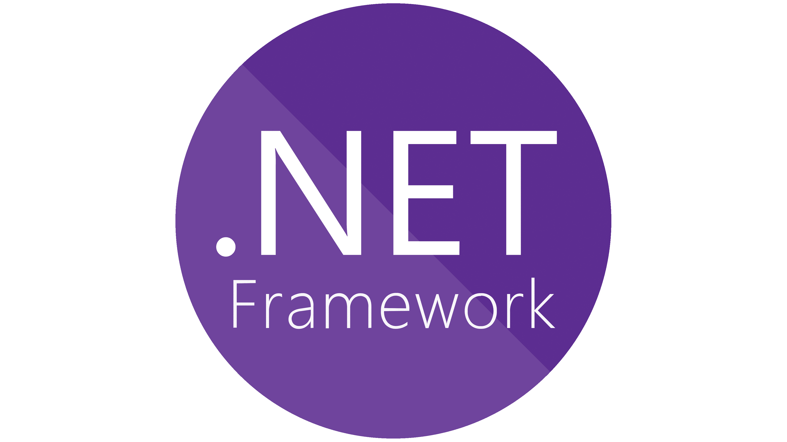

<h1 align="center" title="...and I'm happy to see you here :)"> Hello 👋🏻, I'm Saba Madadi (◔◡◔) 👩🏻‍💻 </h1>
<h3 align="center">Computer science student at Shahid Beheshti University among many other things! </h3>

 💕 (●ˇ∀ˇ●) 💕 

  

 🐾 ƪ(˘⌣˘)ʃ 🐾 

  

- 🔭 I’m currently studying [CS](https://en.wikipedia.org/wiki/Computer_science) at [SBU](https://en.sbu.ac.ir/)!

- 🌱 I’m currently learning **Coding**...

- 📫 Please contact me via <a href="https://t.me/sabamadadi9"> Telegram</a>.
  
- 📱 You can also find me here:    

   <kbd>
  
  
  
  </kbd>

 🦜 (ﾉ◕ヮ◕)ﾉ*:･ﾟ✧ 🦜 

<h3 align="left"> 🔮 Languages and Tools ⚒️

</h3>

                         

 🦋 (👉ﾟヮﾟ)👉 🦋 

  
  
<b>Expand to see my latest project! 👀 </b>

    

      

  

  
  
 🕊️ ༼ つ ◕_◕ ༽つ 🕊️ 

    

 🐞 (●'◡'●) 🐞 

  
&nbsp;&nbsp;

 💗 (❁´◡`❁) 💗 

  

  

  

 👒 (✿◡‿◡) 👒 

&nbsp;

 🧩 ヾ(⌐■_■)ノ♪ 🧩 

&nbsp;

 🌝 ( ﾟдﾟ)つ Bye 🌝 

